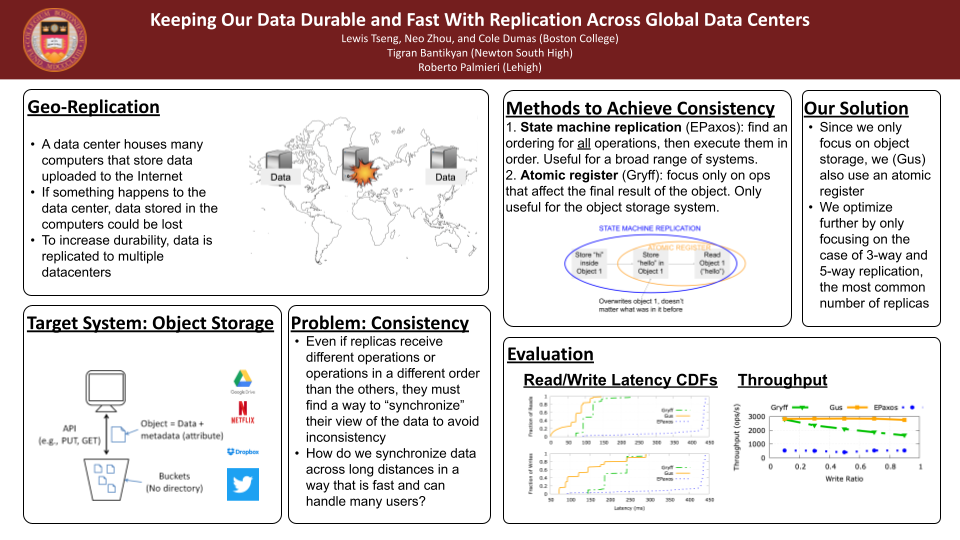

# Gus Experiment Automation
This repo consists of python code that will autonomously run the replication protocol experiments cited in our paper ("Distributed Multi-writer Multi-reader Atomic Register with Optimistically Fast Read and Write") and plot them. See `config_instruction.md` for information on available configs. 

## Table of Contents
- Research Poster
- Dependencies
- How to Run

## Research Poster


## Dependencies
### Code
- Go 1.15 (for replication protocol code)
- Python 3.10 (for running experiments automatically, calculating stats, plotting data)
   - NumPy
      - Install with ```pip install numpy```
   - PrettyTable
      - Install with ```python -m pip install -U prettytable```
   - Matplotlib
      - Install with ```pip install matplotlib```
- GNUPlot
   - See [here](https://riptutorial.com/gnuplot/example/11275/installation-or-setup) to install

- Redis 6.2.2 (for a specific experiment configuration)
### Repositories
- The Gus repository
- The Gryff repository 
  - Note: Both repositories are derived from the EPaxos repository, but have different communication between clients and servers, so it is easier to have two seperate repos.
- The redis repository (for layered experiments)
- The Giza repository
   - This is an adjacent protocol which exists on the “fastpaxos” branch of gus-epaxos. Note: this implementation only sports non conflicting operations.


All of the dependencies mentioned above are preinstalled in the control machine in each Cloudlab profile. The server and client machines only have the code dependencies installed.


## Overview of Recreating Experimental Results

- Figures **5, 6, 7, and 10** are produced by running sub-experiments that each run one a singluar Cloudlab experiment instance. These figures are reproduced the most easily using all of the automation code by following the steps described below.
- Figure **11** requires two different Cloudlab experiments (further details below). The standard plotting method (```plotFigs/plot_figs.py```) does not work here. Instead, experimental results data must be manually copied from ```results/``` into the appropriate subdirectories in ```scale/``` then plots are produced using ```scale/scale_plot.py```. This figure illustrates Gus's performance at different scales (number of replicas) and therefore requires multiple Cloudlab profiles with the most appropriate number of machines allocated. In the figure, the Gus latency percentile results are compared to Tempo results which were previously collected. More info on tempo to be added. 
- Figure **8** is similar to figure **11** in that the standard plotting script is not used. However, experimental data must be manually transformed into latency percentiles and put into csv files before being plotted using ```layered/layered_plot.py```
- Figure **9** is produced using the "Erasure Coding" (EC) branch of gus-epaxos. Like figure **8**, latency percentiles must be manually extracted. Results were plotted manually for this paper, NOT using the steps below.


## How to Run
### Setup
1. Make sure your Cloudlab profile is setup.
   - Make sure you set up ssh access so that you can ssh into a remote Cloudlab machine from your computer.
2. Instantiate the correct Cloudlab profile.
   - For easiest use, do not change any parameters, and name the experiment "test"
   - For nearly all experiments, a Cloudlab profile with 5 replicas is sufficient [this default profile](https://www.cloudlab.us/p/e8d6e4c44ca475f33c04a9a3f52b3583a49bcbb5) unless trying to recreate the results for n=7 or n=9 replicas in **figure 11**
   - Recreating the results seen in figures **8** or **11** requires running multiple experiments across 2 different Cloudlab experiment instances: one with 5 (default) replicas and one with 9 replicas. If attempting to run the sub-experiments on the 9 replicas experiment instance, please use [this expanded profile](INSERT)
   - **For all profiles:** Be sure to use the Utah cluster.
      - The experiments may be run on other clusters, but you will need in the config files you intend to use you must alter the "host_format_str" field (change 'utah' to the appropriate cluster).
3. Connect to the control machine via ssh.
   1. Make sure to include `-A` 
4. Open this repo in the control machine. This repo and others can be found in `/root/go/src`. All repos are stored in root because cloudlab disk images do not save data stored in user home directories.
   1. `sudo su`
   2. `cd ~/go/src/gus-automation`
5. Make sure ``gus-automation`` is up to date.
   - Run ``git pull``
   - If this doesn't work, run ```git reset --hard LATEST_COMMIT``` where LASTEST_COMMIT is the latest commit to the repo on github to update code


### Running Multiple Experiments - With Automatic Results Syncing

1. **Setup config file(s):** On root@control machine, run `python3 set_experiment_name.py EXPERIMENT_NAME` 
   - `EXPERIMENT_NAME` is the experiment name defined when setting up the experiment on cloudlab
   - **Set the experiment name to "test" to skip this step ("test" is the default experiment name)**

2. **Running the experiment:** On root@control machine, run `python3 run_experiments.py CONFIG_PATH CONFIG_PATH ...`
   - Example: ```python3 run_experiments configs/fig6.json configs/fig5.json```
   - Pass in any number of config file paths. Currently all config file paths are under configs. Be sure to modify each config file to desired specs
   - Node delay setup, and experiments (for all 3 protocols) will be run. Results will be in `results` 
3. **Syncing results to local machine:** On local machine, run ```python3 sync_results.py USER@CONTROL_ADDRESS CONFIG_FILE_PATH```
   - On Cloudlab, copy the USER@ADDRESS portion of the ssh command for the control machine for USER@CONTROL_ADDRESS
   - The config file is used to determined the path for the results directory
4. **Plotting:** On local machine, cd to ``plotFigs/`` and run ```python3 plot_figs.py``` to plot the most recent experiment results. Plots appear in ```plots/``` directory
   - Optionally run: ```python3 plot_figs.py [EXPERIMENT_RESULTS_PATH]``` to plot any results.
   - **For figure 8**, Please use ```python3 plotFigs/layered/layered_plot.py```. Latencies were manually extracted from results for the purpose of this paper. Please see ```replication- ... .csv``` files for sample results for both Gus and Giza.
   - **ALTERNATIVELY, for figure 11**, copy the gus client results from the 3 sub experiments (n=5, n=7, n=9) into the corresponding folders in ```plotFigs/scale/clients/```. These results are run on two different profiles and therefore will be under multiple timestamp directories in your results folder (n=5 in one; n=7 and n=9 in the other). Once the results are in the correct folder, run ```cd scale/ ``` and then ```python3 scale_plot/```.
   - **Important**: Automatic plotting for figure 9 has not been implemented. After the figure9 experiment was run, latency percentiles were extracted and plotted manually to produce the plot seen in the paper.
5. **(Optional) Client Metrics**: Print out (or write to file) specified mean and percentiles of experimental results with: ```python3 client_metrics.py PERCENTILE PERCENTILE ...```
   - **Full description of options:** run ```python3 client_metrics [--clear] LOWER_BOUND_OR_SINGLE_PERCENTILE [UPPER_BOUND_OR_SECOND_PERCENTILE] [NTH PERCENTILE]... [-i, --interval=INTERVAL_LENGTH] [--path=results_data_PATH] [--fig=FIG_NAME] [--protocol=PROTOCOL] [--table] [--noprint] [--txt] [--json]```
      - --clear: clears all json and txt files in metrics before writing to any new files
      - --interval=INTERVAL_LENTGTH: set interval of percentiles calculated between upper and lowerbound
         - -i: equivalent to --interval==1
      - --fig:FIG_NAME: include only FIG_NAME
         - can be listed multple times
      - --protocol=PROTOCOL: only include protocol
         - can be listed multiple times
      - --table: prints metrics in table format
      - --noprint: no printing  
      - --txt: saves metrics to text file under metrics
      - --json: saves metrics to json file under metrics
      - Many discrete percentile values can be passed. All but max and min are ignored when interval flag is set. 
      - If UPPER_BOUND is undefined and --interval is set, then UPPER_BOUND=100 .


